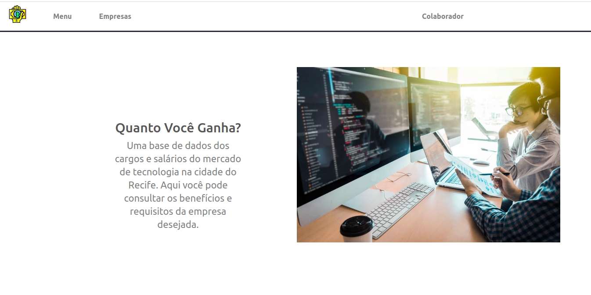

<h1 align="center">
  Quanto você ganha?
</h1>

  <a href="#-tecnologias">Tecnologias</a>&nbsp;&nbsp;&nbsp;|&nbsp;&nbsp;&nbsp;
  <a href="#-projeto">Projeto</a>&nbsp;&nbsp;&nbsp;|&nbsp;&nbsp;&nbsp;
  <a href="#acessar">Acessar</a>&nbsp;&nbsp;&nbsp;|&nbsp;&nbsp;&nbsp;
  <a href="#backend">Backend</a>&nbsp;&nbsp;&nbsp;|&nbsp;&nbsp;&nbsp;
  <a href="#autores">Autores</a>&nbsp;&nbsp;&nbsp;

   
  <h3>Plataforma de Cadastramento de Salários</h3>
   
  

 

<h2 id="-tecnologias">🚀 Tecnologias</h2>

Esse projeto foi desenvolvido com as seguintes tecnologias:

- [Node.js](https://nodejs.org/en/)
- [React](https://reactjs.org)
- [Bootstrap](https://getbootstrap.com/)

<h2 id="-projeto">💻 Projeto</h2>

Plataforma de cadastramento de salários desenvolvida na disciplina Engenharia de Software do curso de Sistemas de Informação na UFPE.

## Acessar

- Disponível em: http://avaliacaoempresa.ddns.net/

<h2 id ="backend">Backend</h2>

- [Repositório do backend](https://github.com/estelasouza/avaliacao-empresas)
- [Relatório do backend](https://colab.research.google.com/drive/1GRltJsZLpph1g5RVIqDv2ViuP3OaBhpu?authuser=1)

<h2 id ="autores">Autores</h2>

- Alunos: 
- Fábio Eduardo 
-- [Github](https://github.com/feduardomelo) e [Linkedin](https://www.linkedin.com/in/eduardo-melo-96b3b1154/) 
- Maria Estela
-- [Github](https://github.com/estelasouza) e [Linkedin](https://www.linkedin.com/in/maria-estela-souza-737ab216a/)

